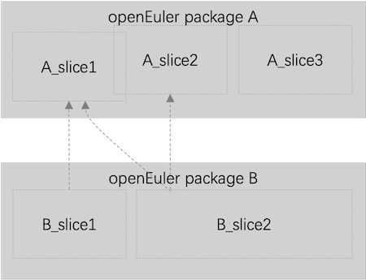

# splitter

## 介绍
splitter用于生成openEuler distroless镜像制作的原材料-slices，通过[EulerPublisher](https://gitee.com/openeuler/eulerpublisher)生成最终distroless镜像并发布。

一般情况下，制作一个应用容器镜像会直接使用`RUN yum install`在镜像中打包所需的应用及其依赖软件包。这种以RPM为最小粒度的镜像打包方式会导致镜像内包含冗余文件，暴露更多攻击点，并且额外增加镜像体积影响传播。

Distroless镜像是一种精简的容器镜像，旨在最小化容器的大小和攻击面。与一般的容器镜像不同，distroless镜像不包含操作系统的许多组件，只包含运行应用程序所需的最小依赖项。

openEuler distroless镜像构建时，首先使用splitter对RPM软件包进行切分处理，每个软件包会被切分成多个slices（每个slice包含一组具有特定功能的文件集合），软件包之间的依赖关系也更精细地表现为slice之间的依赖；然后以slice为最小构建单元生成最终的distroless镜像，可以有效减少冗余文件，进而降低安全风险。



如上图所示，软件包B依赖于软件包A等价于B_slice1和B_slice2依赖于A_slice1、A_slice2，在生成B的应用镜像时，可以不再打包A_slice3所包含的文件。

## 软件架构
软件架构说明


## 安装指南
splitter处于开发阶段，当前仅支持在openEuler上部署（建议使用[install.sh](./install.sh)一键安装）：

1. 安装系统依赖
```
dnf install python3-dnf git python3-pip cpio
```

2. 克隆源码仓库
```
git clone https://gitee.com/openeuler/splitter.git
cd splitter
pip install -r requirements.txt
python3 setup.py install
```

3. 验证
```
splitter --help
```

## 使用说明

### slice releases

openEuler的slice生成依赖于**Slice Definition File(SDF)**定义的软件包切分规则，SDF按照以slice所属的openEuler版本为依据分别发布，所有SDFs以yaml文件存在于[slice-releases](https://gitee.com/openeuler/slice-releases)。[slice-releases](https://gitee.com/openeuler/slice-releases)仓库使用分支名来表示不同的openEuler版本。

以python3.11的SDF（命名为：python3.11.yaml）为例:

```
package: python3

deps:
  - python3_copyright

slices:
  core:
    deps:
      - media-types_data
      - python3_bins
      - python3_stdlib

  standard:
    deps:
      - python3_aix-support
      - python3_all-os
      - python3_concurrency
      - python3_core
      - python3_crypto
      - python3_custom-interpreters
      - python3_data-persistence
      - python3_data-types
      - python3_debug
      - python3_development-tools
      - python3_distribution
      - python3_extras
      - python3_file-formats
      - python3_filesys
      - python3_frameworks
      - python3_importing
      - python3_internet
      - python3_ipc
      - python3_language
      - python3_markup-tools
      - python3_multimedia
      - python3_net-data
      - python3_numeric
      - python3_osx-support
      - python3_pydoc
      - python3_text
      - python3_unix

  utils:
    deps:
      - python3_debug
      - python3_pydoc
      - python3_core
    contents:
      common:
        /usr/bin/pydoc3.11:
        /usr/bin/pydoc3:
        /usr/lib64/libpython3.so*:
        /usr/lib64/libpython3.11.so*:

  copyright:
    contents:
      common:
        /usr/share/licenses/python3/LICENSE:

```
上述SDF，即python3.yaml文件中，`slices`指示python3的软件包被切分为：`python3_core`、`python3_standard`、`python3_utils`和`python3_copyright`四个slices，以及这些slice所包含的文件内容（详细信息请查看[slice-releases](https://gitee.com/openeuler/slice-releases)）。

### splitter生成slice
splitter使用cut命令行对软件包切分生成所需的slices
```angular2html
# 示例
splitter cut -r 24.03-LTS -a x86_64 -o /path/to/output python3_standard python3_utils
```
上述命令中`-r/--release`指定所需slices所属的openEuler版本，`-a/--arch`指定OS架构，`-o/--output`指定生成slices的输出路径，`python3_standard python3_utils`是用户指定要生成的slices。

最终生成的所有slices打包保存在`/path/to/output`目录中。

### 构建distroless容器镜像
[EulerPublisher](https://gitee.com/openeuler/eulerpublisher)集成splitter构建并发布最终distroless镜像


## 参与贡献
欢迎广大开发者参与openEuler distroless镜像生态建设！

1.  请在[slice-releases](https://gitee.com/openeuler/slice-releases)提issue描述对distroless镜像的需求，并与社区讨论、开发相关SDF
2.  关于splitter的需求/bug请提交issue或PR
